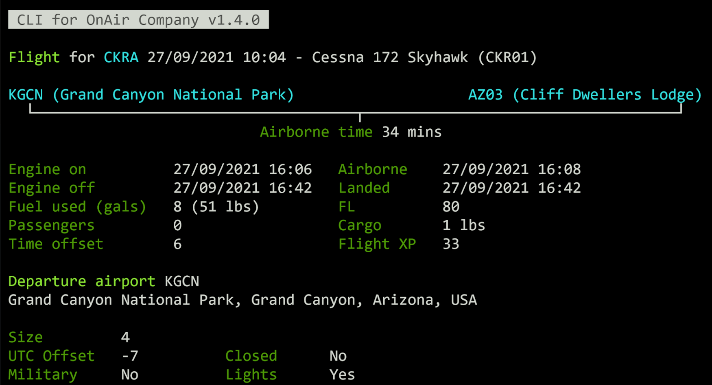

# CLI for OnAir Airline Manager

A CLI (Command Line Interface) to display information such as flights and aircraft from [OnAir Company](https://onair.company) an addictive career add-on for flight simulator games such as Microsoft Flight Simulator and X-Plane! 

_Requires an active OnAir Company subscription and API key_.

## Install

Requires NodeJS, installs via NPM.

`npm i -g onair-cli`

Run

`onair-cli --help`

or run without a global install

`npm exec onair-cli --help`

## Setup

For ease of use save your OnAir credentials.

`onair-cli save-creds --api-key=[API_KEY] --world=[WORLD] --companyId=[COMPANY_ID]`

Your OnAir API key and Company ID are found in the bottom left of the settings page in the OnAir client. The world name is 'cumulus', 'stratus', or 'thunder'. Use 'stratus' for Clear Sky server.

## Commands

### Aircraft

Show details on an aircraft, including it's recent flights.

`onair-cli aircraft <aircraftId>`

'aircraftId' is a 32 character UUID available from the aircraft details page in the OnAir client.

### Airport

Get information about an airport by passing in it's 4 character ICAO code.

`onair-cli airport <ICAO> [options]`

Optionally show airport parking spot information with `--parking-spots`

### Company

Get summary information on your company. **Note:** You must specify or have previously stored a _companyId_ to be able to run Company commands.

`onair-cli company`

### Company Fleet

List details of your company's fleet of aircraft.

`onair-cli company fleet`

### Company Flights

List your company's aircraft flights.

`onair-cli company flights`

This supports pagination showing 20 flights per page, i.e.

`onair-cli company flights -p=2`

### Company FBOs

List your company FBOs, including fuel, fuel selling status and tied down/hanger space.

`onair-cli company fbos`

### Company Jobs

List your company's pending jobs

`onair-cli company jobs`

### Flight

Display flight data and airport info for a completed flight. In-progress or aborted flights are not supported.

`onair-cli flight <flightID>`

'flightID' is a 32 character UUID that is displayed on the completed flights screen of the OnAir Company client.

Optionally show aircraft information too with `--show-aircraft`

### Flights

Lists flights for an aircraft.

`onair-cli flights <aircraftId>`

This supports pagination showing 20 flights per page, i.e.

`onair-cli flights <aircraftId> -p=2`

'aircraftId' is a 32 character UUID available from the aircraft details page in the OnAir client.

### (VA) Virtual Airline
Get summary information for a given virtual airline. **Note:** You must specify or have previously stored a vaId to be able to run VA commands.

`onair-cli va`

### (VA) Virtual Airline Members
Shows the members of a given VA and their associated details. The role name and color will match with whatever OnAir reports.

`onair-cli va members`

### Save Credentials

Your OnAir API key and Company ID are found in the bottom left of the settings page in the OnAir client. The world name is 'cumulus', 'stratus', or 'thunder'. 

`onair-cli set-creds --apiKey=[API_KEY] --world=[WORLD] --companyId=[COMPANY_ID]`

If you are a member of a Virtual Airline (VA), you can also add your VA ID. This can be found in the Manage VA options screen.

`onair-cli set-creds --apiKey=[API_KEY] --world=[WORLD] --companyId=[COMPANY_ID] --vaId=[VIRTUAL_AIRLINE_ID]`

These credentials are stored in the system home directory `~./.onair-credentials`. Alternatively they can be passed into each command if you don't want them saved locally.

### Delete Credentials

`onair-cli delete-creds`

Remove your locally stored OnAir credentials.

## Notes

This application is not affiliated with or endored by OnAir Company. OnAir Airline Manager &copy; OnAir Company.

## License
[MIT](https://choosealicense.com/licenses/mit/)