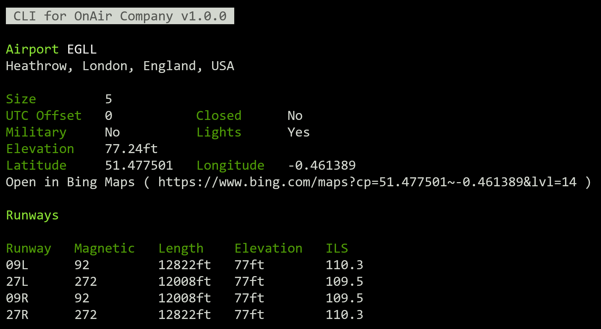

# CLI for OnAir Airline Manager

A CLI to display information such as flights and aircraft from [OnAir Company](https://onair.company) an addictive virtual airline for flight simulator games such as Microsoft Flight Simulator and X-Plane! 

_Requires an active OnAir Company subscription and API key_.

## Install

Requires NodeJS, installs via NPM.

`npm i -g onair-cli`

Run

`onair-cli --help`

or run without an install via npx

`npx onair-cli --help`

## Setup

For ease of use it is recommend to save your OnAir credentials

`onair-cli save-creds --api-key=[API_KEY] --world=[WORLD] --companyId=[COMPANY_ID]`

Your OnAir API key and Company ID are found in the bottom left of the settings page in the OnAir client. The world name is 'cumulus', 'stratus', or 'thunder'. Use 'stratus' for Clear Sky server.

These credentials can also be passed into each command if you don't want them saved locally.

## Commands

### Aircraft

Show details on an aircraft, including it's recent flights.

`onair-cli aircraft <aircraftId>`

'aircraftId' is a 32 character UUID available from the aircraft details page in the OnAir client.

### Airport

Get information about an airport

`onair-cli airport <ICAO> [options]`

Optionally show airport parking spot information with `--parking-spots`

### Company

Get summary information on your company

`onair-cli company`

### Company Fleet

List details of your company's fleet of aircraft.

`onair-cli company fleet`

### Company Flights

List your company's aircraft flights, this supports pagination.

`onair-cli company flights`

`onair-cli company flights -p=2`

### Company FBOs

List your company FBOs, including fuel, fuel selling status and tied down/hanger space.

`onair-cli company fbos`

### Flights

Show flights for an aircraft, this supports pagination.

`onair-cli flights <aircraftId>`

`onair-cli flights <aircraftId> -p=2`

'aircraftId' is a 32 character UUID available from the aircraft details page in the OnAir client.

### Save Credentials

`onair-cli set-creds --apiKey=[API_KEY] --world=[WORLD] --companyId=[COMPANY_ID]`

Your OnAir API key and Company ID are found in the bottom left of the settings page in the OnAir client. The world name is 'cumulus', 'stratus', or 'thunder'.

### Delete Credentials

`onair-cli delete-creds`

Remove your locally stored OnAir credentials.

## Notes

This application is not affiliated with or endored by OnAir Company. OnAir Airline Manager &copy; OnAir Company.

## License
[MIT](https://choosealicense.com/licenses/mit/)